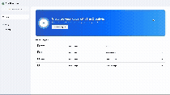

# 🎨 Creativio – Graphic Design SaaS Platform

Creativio is a **feature-rich graphic design SaaS platform** built with **Next.js**, designed to empower users to create, customize, and export professional-quality designs. It combines a **powerful editor**, **AI integrations**, and a **subscription-based business model**, making it ideal for creatives, startups, and teams.

---

## 📸 Demo

🎥 Live Demo: 

## ✨ Features

### 🛠️ Graphic Editor

* **Template System** – Start from customizable templates.
* **Text Tools** – Multiple fonts, text styles, and alignments.
* **Shapes** – Add, resize, and customize geometric shapes.
* **Drawing Tools** – Freehand sketching directly in the editor.
* **History Management** – Undo & redo functionality.
* **Autosave** – Real-time saving of work.

### 🤖 AI Integrations

* **AI Image Generation** – Generate images from text using [Replicate](https://replicate.com).
* **AI Background Removal** – Remove image backgrounds with AI (Replicate).

### 🔒 Authentication & Security

* **Auth.js (NextAuth v5)** for authentication.
* Supports:

  * Google OAuth
  * GitHub OAuth
  * Email & Password credentials

### 💳 Billing & Subscriptions

* **Stripe integration** for secure payments.
* Subscription tiers with usage limits.

### 📤 Export Options

* Export projects as **PNG**, **SVG**, **JPG**, or **JSON**.

---

## 🏗️ Tech Stack

* **Framework**: [Next.js](https://nextjs.org/)
* **API**: [Hono.js](https://hono.dev/)
* **Database**: [Postgres](https://neon.tech/) (NeonDB)
* **ORM**: [DrizzleORM](https://orm.drizzle.team/)
* **Auth**: [Auth.js (NextAuth v5)](https://authjs.dev/)
* **Payments**: [PayStack](https://paystack.com/)
* **AI**: [Replicate](https://replicate.com)
* **UI**: [TailwindCSS](https://tailwindcss.com/) + [Shadcn UI](https://ui.shadcn.com/)

---

## 🚀 Getting Started

### 1. Clone the Repository

```bash
git clone https://github.com/your-username/creativio.git
cd creativio
```

### 2. Install Dependencies

```bash
npm install
# or
yarn install
```

### 3. Environment Variables

Create a `.env.local` file in the root directory and add:

```env
# Database
DATABASE_URL=your_neondb_url

# Auth.js
AUTH_SECRET=your_auth_secret
GOOGLE_CLIENT_ID=your_google_client_id
GOOGLE_CLIENT_SECRET=your_google_client_secret
GITHUB_CLIENT_ID=your_github_client_id
GITHUB_CLIENT_SECRET=your_github_client_secret

# Stripe
STRIPE_SECRET_KEY=your_stripe_secret_key
STRIPE_WEBHOOK_SECRET=your_stripe_webhook_secret

# Replicate
REPLICATE_API_TOKEN=your_replicate_api_token
```

### 4. Run the Development Server

```bash
npm run dev
```

Open [http://localhost:3000](http://localhost:3000) to see your app.

---

## 📦 Project Structure

```
creativio/
│── app/                # Next.js app router
│── components/         # UI components (Tailwind + Shadcn UI)
│── lib/                # Utilities (db, auth, stripe, replicate)
│── pages/api/          # API routes (Hono.js integration)
│── prisma/             # Drizzle ORM schema & migrations
│── public/             # Static assets (fonts, images)
│── styles/             # Global styles
│── .env.local          # Environment variables
│── README.md           # Documentation
```

---

## 🧪 Roadmap

* [ ] Collaborative editing in real-time
* [ ] Template marketplace
* [ ] Team workspaces & roles
* [ ] Advanced AI-driven design suggestions
